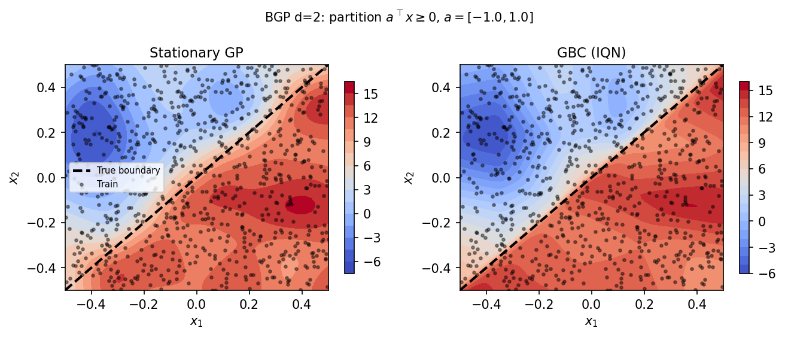

# GBC Surrogates for Computer Experiments {#sec-surrogates}

> "*All models are wrong, but some are useful.*" --- George E.P. Box

The previous chapters built the machinery of Generative Bayesian Computation piece by piece: quantile functions (@sec-quantiles), the noise outsourcing theorem (@sec-noise-outsourcing), the Implicit Quantile Network architecture (@sec-iqn), and the connection to distributional reinforcement learning (@sec-dist-rl). Now we put these tools to work on the problem that motivated the entire enterprise: building surrogates for expensive computer experiments.

A *computer experiment* runs a deterministic or stochastic simulator $f : \mathcal{X} \to \mathbb{R}$ at a collection of input points $x_1, \ldots, x_n \in \mathcal{X} \subseteq \mathbb{R}^d$ and records the outputs $y_i = f(x_i) + \varepsilon_i$. The simulator may represent a finite-element stress analysis, a climate model, a semiconductor fabrication process, or a rocket aerodynamics code. Because each run is expensive --- minutes, hours, or days --- we can afford only a limited budget of $n$ evaluations. A *surrogate* (also called an emulator or metamodel) is a cheap-to-evaluate statistical model trained on the $n$ simulator runs that predicts the output at untried inputs and quantifies the uncertainty of those predictions.

The surrogate problem has a specific structure that distinguishes it from general supervised learning. First, the training data is expensive and therefore small: $n$ is typically in the hundreds or thousands, not millions. Second, the inputs are controlled by the experimenter, usually via a space-filling design (Latin hypercube, maximin, etc.) rather than drawn from a natural data-generating process. Third, uncertainty quantification is a first-class requirement, not an afterthought: the surrogate must report not just its best prediction but how confident it is, because the uncertainty drives downstream decisions about where to evaluate the simulator next (sequential design), how to optimize over the response surface (Bayesian optimization), or how to propagate parameter uncertainty through the model (uncertainty propagation). These requirements have traditionally made the GP the surrogate of choice, because its closed-form posterior provides exactly the mean-and-variance predictions that downstream methods expect. The question this chapter addresses is whether a different framework --- GBC via IQNs --- can match or exceed the GP's predictive performance while offering better scalability and distributional flexibility.

For decades, the default surrogate has been the *Gaussian process* (GP). GPs deliver closed-form uncertainty quantification and exact interpolation at observed points. But they have three structural limitations: cubic computational scaling in $n$, stationarity assumptions that struggle with discontinuities, and Gaussian predictive distributions that cannot capture asymmetric or heavy-tailed responses. As we showed in @sec-iqn, the IQN addresses all three: it trains in $\mathcal{O}(n)$ time via SGD, adapts locally to non-stationary features, and produces the full conditional quantile function --- not just a mean and variance.

This chapter compares GBC surrogates to GP baselines on a sequence of benchmarks of increasing complexity. We begin with a review of GP regression to establish the notation and the baseline (@sec-surr-gp), including a discussion of kernel physical meaning and sparse GP approximations. We then articulate the case for GBC as an alternative surrogate (@sec-surr-gbc), organized around three themes: computational scaling, distributional flexibility, and the small-sample tradeoff. A pedagogical 1D example (@sec-surr-1d-demo) precedes the main benchmarks. The core of the chapter consists of benchmark comparisons: piecewise-continuous processes in two to four dimensions (@sec-surr-bgp), a ten-dimensional function with inert variables (@sec-surr-friedman), and a scaling study that pushes sample sizes beyond the reach of dense GPs (@sec-surr-scaling). We close with a practical decision guide (@sec-surr-decision) and exercises (@sec-surr-exercises). The chapter that follows (@sec-jumps) handles the harder case of sharp jump discontinuities using boundary augmentation.


## Gaussian Process Review {#sec-surr-gp}

We covered GP fundamentals in the context of Bayesian nonparametrics earlier in the book. Here we summarize only what is needed for the surrogate comparison, following the notation of @gramacy2020surrogates and @rasmussen2006gaussian. The reader already familiar with GPs can skim this section and proceed to @sec-surr-gbc, but we recommend paying attention to @sec-surr-kernels (on the physical meaning of kernels) and @sec-surr-sparse-gp (on GP approximations), as these subsections contain insights that are essential for understanding when and why GPs fail on the benchmarks of @sec-surr-bgp and @sec-surr-friedman.

Consider a black-box simulator $y = f(x) + \varepsilon$, where $x \in \mathcal{X} \subseteq \mathbb{R}^d$ and $\varepsilon \sim \mathcal{N}(0, \sigma^2_\varepsilon)$ represents observation noise (or numerical noise in a deterministic code, in which case $\sigma^2_\varepsilon \to 0$). A GP surrogate places a *Gaussian process prior* on $f$, which means we assume that $f$ is a random function drawn from a distribution over functions. The defining property of a GP is that any finite collection of function values has a joint Gaussian distribution. Formally, for any finite collection $X_n = (x_1, \ldots, x_n)^\top$,
$$
Y_n \mid X_n \sim \mathcal{N}_n\!\left(\mu \mathbf{1}_n,\, \mathbf{K}(X_n) + \sigma^2_\varepsilon \mathbf{I}_n\right),
$$ {#eq-gp-prior}
where $\mathbf{K}(X_n)$ is the $n \times n$ covariance matrix with entries $K_{ij} = k(x_i, x_j)$, and $k(\cdot, \cdot)$ is a *kernel function* that encodes our prior beliefs about the smoothness and correlation structure of $f$.

### Kernels and Their Physical Meaning {#sec-surr-kernels}

The kernel determines not just how much we expect nearby points to correlate, but the entire character of the functions we believe the simulator produces. Choosing a kernel is equivalent to choosing a prior over function space: different kernels generate different families of functions, with different smoothness, periodicity, and correlation structure. This is a powerful modeling tool --- the practitioner can encode domain knowledge directly into the kernel --- but it is also a responsibility, because a misspecified kernel leads to incorrect uncertainty quantification. Two kernels dominate the computer experiments literature, and understanding their physical content is essential for knowing when the GP assumption is appropriate --- and when it is not.

The *squared exponential (SE)* kernel, also called the radial basis function (RBF), is:
$$
k_{\text{SE}}(x, x') = \sigma^2_f \exp\!\left(-\frac{\|x - x'\|^2}{2\ell^2}\right),
$$ {#eq-kernel-se}
where $\sigma^2_f$ is the signal variance and $\ell$ is the length scale. The signal variance $\sigma^2_f$ controls the vertical amplitude of the function: it sets the prior standard deviation of $f(x)$ at any single point. If we expect the simulator to produce outputs ranging over hundreds of units, $\sigma_f$ should be large; if the response is tightly concentrated, it should be small. The length scale $\ell$ is more subtle and more consequential. Physically, $\ell$ measures how far we must move in input space before the function value changes substantially. When $\|x - x'\| \ll \ell$, the kernel is close to $\sigma^2_f$ and the GP predicts that $f(x) \approx f(x')$; when $\|x - x'\| \gg \ell$, the kernel decays to zero and the function values become essentially uncorrelated. A length scale of $\ell = 0.1$ in a unit-cube input space means the function "forgets" its value over a distance of about one-tenth of the domain --- producing rapid local variation. A length scale of $\ell = 1.0$ means the function is correlated across the entire domain --- producing gentle, slowly-varying surfaces.

This has a critical implication: the SE kernel generates sample paths that are infinitely differentiable. This follows from the fact that the kernel itself is infinitely smooth (it is an entire function of $\|x - x'\|^2$). For a simulator that produces smooth responses --- a heat transfer code, an aerodynamic lift coefficient away from the sound barrier --- this is a reasonable prior. But for a simulator whose output jumps discontinuously when a parameter crosses a threshold (a phase transition, a control limit, a regime boundary), infinite smoothness is exactly wrong. The SE kernel cannot represent a step function; it will either blur the jump into a sigmoid-like transition (if $\ell$ is large) or develop Gibbs-like oscillations near the discontinuity (if $\ell$ is small). Neither is satisfactory.

The *Matern-$\nu$* family offers a continuum of smoothness:
$$
k_{\nu}(r) = \sigma^2_f \frac{2^{1-\nu}}{\Gamma(\nu)}\left(\frac{\sqrt{2\nu}\, r}{\ell}\right)^{\!\nu} K_\nu\!\left(\frac{\sqrt{2\nu}\, r}{\ell}\right),
$$ {#eq-kernel-matern}
where $r = \|x - x'\|$ and $K_\nu$ is the modified Bessel function of the second kind. The parameter $\nu$ controls smoothness: $\nu = 1/2$ gives the exponential kernel (rough, Ornstein--Uhlenbeck paths), $\nu = 3/2$ gives once-differentiable paths, and $\nu = 5/2$ gives twice-differentiable paths. The Matern-$5/2$ kernel is the standard choice in computer experiments [@gramacy2020surrogates; @santner2018design] and is used as the GP baseline throughout this chapter. Compared to the SE kernel, Matern-$5/2$ allows more local roughness --- its sample paths have only two continuous derivatives rather than infinitely many --- which makes it more forgiving when the true function has moderate non-smoothness. But it is still a stationary kernel: the same smoothness and correlation structure applies everywhere in the input space, and it still cannot represent a genuine discontinuity.

In higher dimensions, it is common to use *separable* (also called automatic relevance determination, or ARD) kernels with a different length-scale parameter $\ell_j$ per input dimension:
$$
k(x, x') = \sigma^2_f \exp\!\left(-\sum_{j=1}^d \frac{(x_j - x'_j)^2}{2\ell_j^2}\right).
$$
This allows the GP to automatically discover which inputs are active and which are inert. A large $\ell_j$ means the function is nearly flat along dimension $j$; a small $\ell_j$ means dimension $j$ drives rapid variation. The ARD mechanism is one of the GP's genuine strengths: it performs implicit variable selection, concentrating the model's attention on the relevant subspace. As we will see in @sec-surr-friedman, however, ARD length scales capture only additive sensitivity --- they cannot represent nonlinear interactions between pairs of inputs.


### Prediction and Hyperparameter Estimation {#sec-surr-gp-prediction}

With the kernel specified, the GP provides closed-form predictions. No sampling, no MCMC, no variational approximation --- just linear algebra.

Given training data $(X_n, y_n)$ and test inputs $X_*$, the posterior predictive distribution is Gaussian with closed-form mean and covariance (the *kriging equations*):
$$
\mu_*(X_*) = \mu + \mathbf{K}_*^\top (\mathbf{K} + \sigma^2_\varepsilon \mathbf{I})^{-1} (y_n - \mu\mathbf{1}),
$$ {#eq-gp-mean}
$$
\Sigma_*(X_*) = \mathbf{K}_{**} - \mathbf{K}_*^\top (\mathbf{K} + \sigma^2_\varepsilon \mathbf{I})^{-1} \mathbf{K}_*,
$$ {#eq-gp-var}
where $\mathbf{K} = k(X_n, X_n)$, $\mathbf{K}_* = k(X_n, X_*)$, $\mathbf{K}_{**} = k(X_*, X_*)$.

@eq-gp-mean and @eq-gp-var are exact --- no sampling, no approximation, no iterative algorithm. The computational cost is dominated by the matrix inversion (or equivalently, Cholesky decomposition), which we discuss in @sec-surr-gp-limits.

The hyperparameters $\theta = (\sigma^2_f, \ell_1, \ldots, \ell_d, \sigma^2_\varepsilon)$ are estimated by maximizing the *log marginal likelihood*:
$$
\log p(y_n \mid X_n, \theta) = -\frac{1}{2}(y_n - \mu\mathbf{1})^\top (\mathbf{K} + \sigma^2_\varepsilon \mathbf{I})^{-1} (y_n - \mu\mathbf{1}) - \frac{1}{2} \log |\mathbf{K} + \sigma^2_\varepsilon \mathbf{I}| - \frac{n}{2}\log 2\pi.
$$ {#eq-gp-mll}

The log marginal likelihood serves as an automatic Occam's razor. The first term, $-\frac{1}{2}(y_n - \mu\mathbf{1})^\top (\mathbf{K} + \sigma^2_\varepsilon \mathbf{I})^{-1} (y_n - \mu\mathbf{1})$, rewards data fit: it is small when the mean-centered data lies in a high-density region of the prior. The second term, $-\frac{1}{2}\log|\mathbf{K} + \sigma^2_\varepsilon \mathbf{I}|$, penalizes model complexity: a kernel with small length scale spreads probability mass over many functions, increasing the determinant and making this term more negative. Maximizing the sum balances these two objectives automatically. This is the GP analog of cross-validation: by integrating out the function values, the marginal likelihood evaluates the kernel's ability to explain the data using only its structural assumptions. A kernel that is too smooth (large $\ell$) will have high data-fit cost because it assigns low probability to the observed fluctuations; a kernel that is too rough (small $\ell$) will have high complexity cost because it can explain many different datasets equally well. The MLE hyperparameters sit at the balance point.

### Structural Limitations of the GP Framework {#sec-surr-gp-limits}

The GP framework has three structural constraints that limit its applicability as a general-purpose surrogate. These are not implementation deficiencies that better software can fix; they are consequences of the mathematical structure of the GP model itself.

The first limitation is *cubic scaling.* Evaluating @eq-gp-mll requires a Cholesky decomposition of the $n \times n$ covariance matrix, costing $\mathcal{O}(n^3)$ flops and $\mathcal{O}(n^2)$ storage. To put this in concrete terms: at $n = 1{,}000$, the Cholesky costs roughly $10^9/3 \approx 3 \times 10^8$ flops, which takes about 0.1 seconds on a modern CPU. At $n = 10{,}000$, it costs $10^{12}/3$ flops, taking about 100 seconds. At $n = 100{,}000$, it costs $10^{15}/3$ flops, which would take about 28 hours. This cubic growth limits plain GPs to $n \lesssim 5{,}000$--$10{,}000$ on standard hardware.

The second is *stationarity.* The kernel $k(x, x')$ depends only on $\|x - x'\|$, encoding the assumption that the correlation structure is spatially uniform. This means the GP believes the function has the same roughness, the same amplitude of variation, and the same noise level everywhere in the input space. Non-stationary dynamics --- regime changes, heteroscedasticity, discontinuities --- require bespoke extensions: treed GPs, which partition the input space into regions with separate GP fits; deep GPs, which compose multiple GP layers to learn warped input spaces; or explicit jump models like the modular GP of @flowers2026modular and the Bayesian analysis of @park2026active. Each modification adds inference complexity and requires additional structural choices (how many tree splits, how many GP layers, what jump-detection method).

The third is *Gaussian predictive distributions.* The posterior @eq-gp-mean--@eq-gp-var is Gaussian by construction. This means symmetric prediction intervals and thin tails. If the true conditional distribution of $Y \mid x$ is skewed, bimodal, or heavy-tailed, the GP can only approximate it as a Gaussian. Heteroscedastic extensions like `hetGP` [@binois2018practical] model spatially-varying variance but still assume Gaussian conditionals. Warped GPs [@snelson2004warped] apply a nonlinear transformation to the output to handle non-Gaussian marginals, but the warping function must be specified a priori and the resulting posterior is no longer available in closed form. The fundamental constraint is that the GP's analytical tractability comes from the Gaussian assumption, and relaxing that assumption requires approximations that erode the GP's core advantage.


### Sparse and Local GP Approximations {#sec-surr-sparse-gp}

The cubic cost of GP inference has generated a cottage industry of approximation methods, each trading fidelity for scalability. Scalability fixes exist but each introduces new assumptions, new tuning parameters, and new failure modes --- and none addresses the stationarity or Gaussian-conditional limitations.

*Sparse variational GPs* [@titsias2009variational] replace the full $n \times n$ covariance matrix with a low-rank approximation based on $m$ *inducing points* $Z = (z_1, \ldots, z_m)^\top$ placed in the input space. The key idea is to approximate the GP posterior through a variational distribution $q(f_Z)$ that conditions on the function values at the inducing points. The resulting joint distribution is:
$$
p(f \mid y) \approx \int p(f \mid f_Z)\, q(f_Z)\, df_Z,
$$
where $p(f \mid f_Z)$ is the GP's conditional prior given the inducing values and $q(f_Z) = \mathcal{N}(\mathbf{m}, \mathbf{S})$ is a free-form Gaussian with variational parameters $(\mathbf{m}, \mathbf{S})$. Training optimizes both the variational parameters and the inducing-point locations by maximizing an evidence lower bound (ELBO). The resulting cost is $\mathcal{O}(nm^2)$ per iteration --- a dramatic improvement when $m \ll n$, but still super-linear in $n$ and requiring the choice of $m$ (typically 500--2,000).

The approximation is exact in the limit $m \to n$ but introduces a systematic bias for small $m$: the inducing points act as a set of "summary statistics" for the entire dataset, and if the response surface has more local structure than $m$ points can represent, the approximation under-fits. This is particularly problematic near discontinuities, where the inducing points must be placed densely along the boundary to capture the sharp transition. Stochastic variational extensions [@hensman2013gaussian] further reduce per-iteration cost by sub-sampling data, but convergence can be slow on heterogeneous response surfaces.

*Vecchia approximations* [@vecchia1988estimation; @katzfuss2021general] exploit the *screening effect*: in a well-ordered dataset, the conditional distribution of $f(x_i)$ given all previous observations can be well approximated by conditioning on only the $m$ nearest neighbors. The intuition is that, for a stationary GP, once you condition on the function values at nearby points, more distant observations provide diminishing additional information --- they are "screened" by the nearby ones. This yields a sparse Cholesky factor with $\mathcal{O}(nm^3)$ cost and $\mathcal{O}(nm)$ storage, a substantial improvement over the dense GP when $m \ll n$. Vecchia approximations have been particularly successful in geostatistics and spatial modeling, where the data has a natural spatial ordering and the screening effect is strong. However, their accuracy depends on the conditioning set size $m$ and the ordering scheme (maximin ordering is a common choice), and they inherit the GP's stationarity assumption. For non-stationary response surfaces, the screening effect may not hold: a point on one side of a discontinuity cannot be "screened" from a point on the other side by points near the boundary, because the function values on opposite sides are nearly independent.

*Local GPs* [@gramacy2015local] take a different approach: rather than approximating a single global GP, they fit a separate small GP in the neighborhood of each prediction point. The `laGP` package uses a greedy algorithm to select the optimal local subset of $m$ training points for each test location, producing predictions in $\mathcal{O}(m^3)$ per test point. This is fast and embarrassingly parallel, but it sacrifices global coherence: the predicted surface may not be smooth across neighborhood boundaries, and the method cannot share information across distant regions of the input space. Local GPs also require choosing the neighborhood size $m$, which involves a bias-variance tradeoff analogous to bandwidth selection in kernel smoothing. A small $m$ (say, 20--50) gives fast predictions but high variance; a large $m$ (say, 200--500) approaches the full GP's accuracy but also its computational cost. The `laGP` package defaults to $m = 6d + 1$ and uses an ALC (Active Learning Cohn) criterion to select the most informative local points, but these defaults may not be optimal for all problems.

Local GPs have a structural affinity with the IQN in one respect: both methods make predictions using only a "local" subset of information. The IQN achieves this through its learned representation --- the hidden layers project the input into a feature space where only nearby patterns in feature space (not necessarily nearby in input space) influence the prediction. The difference is that the IQN's "neighborhoods" are learned end-to-end rather than defined by Euclidean distance, giving it more flexibility to handle non-stationary structure.

Each of these approximations addresses the cubic cost while preserving some GP properties (closed-form predictions, calibrated intervals), but none escapes the fundamental constraints of stationarity and Gaussian predictive distributions. Moreover, the approximations introduce their own tuning decisions. Sparse variational GPs require choosing the number and placement strategy for inducing points. Vecchia approximations require choosing the conditioning set size and ordering scheme. Local GPs require choosing the neighborhood size and the local kernel. Each choice interacts with the data in non-obvious ways, and the practitioner must navigate a meta-optimization problem on top of the usual hyperparameter estimation.

GBC's mini-batch SGD, by contrast, is $\mathcal{O}(n)$ per epoch with no inducing points, no neighborhood selection, and no ordering scheme. The neural network learns whatever smoothness structure the data supports, including non-stationarity and non-Gaussian conditionals. The tradeoff is the loss of the GP's closed-form posterior and its exact interpolation property. Whether this tradeoff is worthwhile depends on the problem, as we will see in the benchmarks that follow.

These three limitations --- cubic scaling, stationarity, and Gaussian conditionals --- together with the complexity of their various workarounds, motivate the search for an alternative surrogate framework. The ideal alternative would train in $\mathcal{O}(n)$ time, handle non-stationarity automatically, and produce arbitrary (non-Gaussian) predictive distributions. The IQN from @sec-iqn achieves all three.


## GBC as an Alternative to GP {#sec-surr-gbc}

The GBC surrogate replaces the GP with an Implicit Quantile Network that maps $(x, \tau) \mapsto \hat{Q}(\tau \mid x)$, where $\tau \sim \text{Uniform}(0,1)$. By the noise outsourcing theorem (@sec-noise-outsourcing), this is sufficient to represent any conditional distribution of $Y$ given $x$. The IQN architecture and training loss were described in @sec-iqn; here we focus on the surrogate-specific advantages and trade-offs.

The GP models the response as a random function drawn from a Gaussian prior and conditions on observed data to obtain a Gaussian posterior. Everything is Gaussian, everything is analytic, and the kernel encodes all prior knowledge.
The GBC model makes no distributional assumptions. It learns a mapping from $(x, \tau)$ to quantiles by minimizing the pinball loss on training data. The resulting quantile function encodes the full conditional distribution of $Y \mid x$, from which we can extract any summary statistic (mean, median, variance, prediction intervals, density) by evaluating at appropriate $\tau$ values. The prior knowledge is implicit in the network architecture and training procedure rather than explicit in a kernel function.

The comparison between GP and GBC surrogates is organized around three themes: computational scaling, distributional flexibility, and the small-sample tradeoff.

### Computational Scaling: $\mathcal{O}(n)$ versus $\mathcal{O}(n^3)$ {#sec-surr-scaling-theory}

The most consequential difference is computational. The GP's dominant cost is the Cholesky decomposition of the $n \times n$ covariance matrix $\mathbf{K} + \sigma^2_\varepsilon \mathbf{I}$, which requires $n^3/3$ floating-point operations and $n^2/2$ storage. This decomposition must be performed for every evaluation of the log marginal likelihood (@eq-gp-mll) during hyperparameter optimization, and typical optimizers require 10--100 such evaluations. The total training cost is therefore $\mathcal{O}(n^3)$ with a constant factor proportional to the number of optimizer iterations.

The IQN is trained by mini-batch SGD, with cost $\mathcal{O}(n \cdot E \cdot L \cdot w^2)$ per epoch, where $E$ is the number of epochs, $L$ the number of layers, and $w$ the layer width. This is linear in $n$. There is no covariance matrix to invert. The per-batch cost is $\mathcal{O}(B_{\text{batch}} \cdot L \cdot w^2)$ where $B_{\text{batch}}$ is the mini-batch size, and the number of batches per epoch is $n / B_{\text{batch}}$. On a modern GPU, training on $n = 100{,}000$ points takes minutes, not the days or weeks that a dense GP would require (if it were feasible at all).

At test time, a single forward pass through the network produces $\hat{Q}(\tau \mid x_*)$ for any quantile level $\tau$. The cost is $\mathcal{O}(B \cdot L \cdot w^2)$ for $B$ quantile samples, independent of the training-set size $n$. A GP must multiply by $\mathbf{K}_*^\top \mathbf{K}^{-1}$, which costs $\mathcal{O}(n)$ per test point (after the one-time $\mathcal{O}(n^3)$ Cholesky). For applications that require predictions at millions of test points --- as in design optimization or Monte Carlo integration over the surrogate --- the constant-time prediction cost of the IQN is decisive. A GP trained on $n = 10{,}000$ points requires $10{,}000$ kernel evaluations for each new test point; the IQN requires only a fixed-cost forward pass through a small network.

In the scaling study of @sec-surr-scaling, we will see that the crossover point where GBC becomes faster than a dense GP occurs at approximately $n = 1{,}500$. Below this threshold, the Cholesky decomposition of a small matrix is cheaper than thousands of gradient-descent epochs. Above it, the cubic cost dominates and the GP becomes impractical.

The sparse and local approximations discussed in @sec-surr-sparse-gp push this boundary somewhat --- a sparse variational GP with $m = 500$ inducing points can handle $n = 50{,}000$ in reasonable time --- but the fundamental scaling asymmetry remains. Moreover, the sparse GP introduces a new source of approximation error that grows with $n/m$, while the IQN's approximation error decreases monotonically with $n$ (more data means a better-trained network). The practical consequence is that the GBC approach has a simpler relationship between data size and accuracy: more data is always better, with no computational ceiling.

### Distributional Flexibility {#sec-surr-dist-flex}

The second theme is the nature of the predictive distribution. The GP produces a Gaussian predictive distribution at every test point, parameterized by a posterior mean and variance. This is both a strength and a constraint. On smooth problems with homoscedastic noise, the Gaussian assumption is accurate and the GP's posterior intervals are well-calibrated by construction (when the kernel is correctly specified). But many simulators produce responses whose conditional distribution is non-Gaussian: heteroscedastic (variance depends on input), skewed (one-sided risk), or multimodal (regime mixtures).

Consider, for example, a climate model that outputs the temperature of a lake at various depths. At shallow depths, the temperature is tightly constrained by atmospheric conditions and has low variance; at the thermocline, temperature fluctuates widely depending on mixing dynamics, producing high variance and possibly a bimodal distribution (mixed vs. stratified states). A GP with a constant-noise model $\sigma^2_\varepsilon$ produces the same predictive interval width at all depths, systematically over-covering at shallow depths and under-covering at the thermocline. The `hetGP` extension models $\sigma^2_\varepsilon(x)$ as a GP itself, addressing heteroscedasticity at the cost of doubling the inference problem. Even then, the predictive distribution at each depth is still Gaussian --- it cannot capture the bimodality at the thermocline.

The IQN learns the full conditional quantile function $\hat{Q}(\tau \mid x)$, which can represent any continuous distribution. Native heteroscedasticity comes for free: if the response has input-dependent variance, the quantile bands widen automatically where the data is noisier, without any explicit heteroscedastic model. We demonstrated this on the motorcycle data in @sec-iqn-motorcycle and in the 1D demo of @sec-surr-1d-demo. Non-Gaussian predictive distributions --- skewed, heavy-tailed, or multimodal --- are handled by the same architecture with no modifications. If the true conditional distribution at the thermocline is bimodal, the IQN's quantile function will develop a flat region between the two modes, and the prediction interval will span both modes naturally.

The GP requires choosing a kernel function (SE vs. Matern, smoothness parameter, ARD vs. isotropic) and estimating its hyperparameters. This is both a strength (the kernel encodes useful prior knowledge) and a weakness (a poorly chosen kernel degrades performance). The IQN uses the same architecture for all problems --- the network learns the appropriate smoothness from data.

### The Small-$n$ Tradeoff {#sec-surr-small-n}

The third theme is less favorable to GBC. A noiseless GP with nugget $\sigma^2_\varepsilon = 0$ interpolates the training data exactly: $\hat{f}(x_i) = y_i$ for all $i$. This is a consequence of the GP's conditional distribution: at a training point $x_i$, the posterior variance is zero (or $\sigma^2_\varepsilon$ if noise is present), and the posterior mean passes through the observation. The IQN is a global approximator and does not, in general, pass through the training points. For deterministic computer codes where exact interpolation is desirable, the GP has a structural advantage. This matters because computer experiments often involve deterministic simulators: the same input always produces the same output, and any discrepancy between the surrogate and the simulator at a training point is pure approximation error, not noise.

More broadly, the GP prior encodes smoothness assumptions that provide effective regularization at small sample sizes. With $n = 50$ training points in $d = 2$ dimensions, a well-tuned GP produces a credible surrogate because the Matern kernel constrains the function to be smooth, and the posterior must pass through (or near) all observed points. This combination of smoothness prior and exact interpolation creates a powerful inductive bias that is difficult for any neural network to match from limited data. The IQN, lacking this inductive bias, typically needs $n = 500$--$1{,}000$ or more to achieve comparable accuracy. The network must learn the function's smoothness from the data itself, through the interaction of the pinball loss and the weight-decay regularizer, which is a less efficient use of information than encoding smoothness directly in the prior.

As $n$ grows, however, the balance shifts. The IQN's advantage in capturing non-stationarity, nonlinear interactions, and non-Gaussian conditionals outweighs the GP's prior advantage. This crossover is a recurring pattern in the benchmarks of this chapter and the active learning results of @sec-active-learning. The GP's strength at small $n$ is a direct consequence of its strong assumptions; those same assumptions become liabilities when the data is rich enough to reveal structure that violates them.

GP posterior intervals are calibrated by construction when the kernel is correctly specified --- a qualifier that carries more weight than it might seem. "Correctly specified" means that the true function is a realization of the GP prior with the estimated kernel, which is never literally true for a real simulator. Misspecification of the kernel (e.g., using an SE kernel on a Matern-$3/2$ function, or a stationary kernel on a non-stationary surface) can produce arbitrarily poor coverage. In practice, the GP's coverage is often good because the Matern-$5/2$ kernel is a reasonable default for many smooth simulators, but the practitioner should not assume that GP intervals are automatically well-calibrated.

IQN uncertainty comes from the learned quantile function, which can also be miscalibrated --- typically slightly under-covering on small-$n$ smooth problems and over-covering on large-$n$ problems. The GP hyperparameters $(\sigma^2_f, \ell, \sigma^2_\varepsilon)$ have clear physical interpretations (signal variance, correlation length, noise level). The IQN hyperparameters (hidden dimension, number of layers, learning rate) are harder to interpret, though they are arguably easier to set: a single architecture (256 hidden units, 32 cosine frequencies, learning rate $10^{-3}$) works across a wide range of problems without per-problem tuning. We used this default architecture on every benchmark in this chapter, changing only the number of training epochs.

These three themes interact in practice: the small-$n$ regime where the GP excels is also the regime where the GP's cubic cost is manageable, and the large-$n$ regime where GBC excels is also the regime where the GP is infeasible. This fortunate alignment means that the practitioner rarely faces a difficult choice: the problem's data size naturally selects the appropriate method.

The GP's closed-form posterior is a significant advantage for downstream applications that expect a Gaussian predictive distribution. Bayesian optimization, for example, computes an acquisition function (Expected Improvement, Upper Confidence Bound, etc.) from the posterior mean and variance. These acquisition functions have well-understood theoretical properties under the GP model. Replacing the GP with an IQN requires reformulating the acquisition function in terms of quantiles rather than moments, which is possible (and we discuss it in @sec-active-learning) but requires care. For applications that simply need a point prediction and an uncertainty band, the two frameworks are interchangeable; for applications that require the full Gaussian posterior structure, the GP retains a practical edge.

@tbl-gp-vs-gbc summarizes the key differences between GP and GBC surrogates. The remainder of the chapter tests these claims empirically.

| Feature | GP | GBC (IQN) |
|:---|:---|:---|
| Training cost | $\mathcal{O}(n^3)$ | $\mathcal{O}(n)$ per epoch |
| Prediction cost | $\mathcal{O}(n)$ per point | $\mathcal{O}(1)$ per point |
| Predictive distribution | Gaussian | Arbitrary (quantile function) |
| Heteroscedasticity | Requires extension (e.g., hetGP) | Native |
| Interpolation | Exact (noiseless GP) | Approximate |
| Kernel choice | Required | Not needed |
| Small-$n$ performance | Strong (prior regularization) | Weaker (needs more data) |
| Scalability limit | $n \lesssim 10\text{k}$ | $n > 100\text{k}$ feasible |

: Comparison of GP and GBC surrogate properties. {#tbl-gp-vs-gbc}


## A 1D Pedagogical Example {#sec-surr-1d-demo}

We fit a GBC surrogate on a simple one-dimensional function to see what the IQN learns and how its predictions differ from a GP's. This example trains in seconds on a laptop CPU, and we encourage the reader to reproduce it and experiment with different functions and noise structures.

We use the function $f(x) = \sin(3x) + 0.3\cos(9x)$ on $[0, 2\pi]$ with heteroscedastic noise whose variance increases with $x$:
$$
y_i = f(x_i) + \varepsilon_i, \quad \varepsilon_i \sim \mathcal{N}\!\left(0,\, (0.1 + 0.3 x_i / 2\pi)^2\right).
$$
This heteroscedastic structure is common in real computer experiments: a semiconductor process simulator may produce tightly controlled outputs at low temperatures but highly variable outputs near a phase transition; an aerodynamic simulator may give precise lift coefficients at low angles of attack but turbulent, noisy responses near stall. This is a toy problem that trains in seconds, but it illustrates two key features of the GBC surrogate: the ability to learn a nonlinear mean function and the automatic adaptation of prediction intervals to heteroscedastic noise.

```{python}
#| eval: true
#| code-fold: false
#| output: false
import numpy as np
import torch
from gbc import IQN, train_iqn, sample_iqn
from gbc.metrics import crps_samples, coverage

# Generate 1D heteroscedastic data
rng = np.random.default_rng(42)
n_train = 300
x_train = rng.uniform(0, 2 * np.pi, size=n_train)
noise_std = 0.1 + 0.3 * x_train / (2 * np.pi)
y_train = (np.sin(3 * x_train) + 0.3 * np.cos(9 * x_train)
           + rng.normal(0, noise_std))

# Reshape for the IQN (expects 2D input)
X_train = x_train.reshape(-1, 1)

# Train GBC surrogate (fast: ~5 seconds)
model, xm, xs, ym, ys = train_iqn(
    X_train, y_train, epochs=2000, hdim=128, nh=32, seed=42
)

# Predict on a fine grid
x_grid = np.linspace(0, 2 * np.pi, 200).reshape(-1, 1)
samples = sample_iqn(model, x_grid, xm, xs, ym, ys, B=500)
# samples shape: (500, 200)

# Compute median and 90% prediction interval
q05 = np.quantile(samples, 0.05, axis=0)
q50 = np.quantile(samples, 0.50, axis=0)
q95 = np.quantile(samples, 0.95, axis=0)

# Evaluate on held-out test set
n_test = 200
x_test = rng.uniform(0, 2 * np.pi, size=n_test)
noise_test = 0.1 + 0.3 * x_test / (2 * np.pi)
y_test = (np.sin(3 * x_test) + 0.3 * np.cos(9 * x_test)
          + rng.normal(0, noise_test))
X_test = x_test.reshape(-1, 1)
test_samples = sample_iqn(model, X_test, xm, xs, ym, ys, B=500)

rmse = np.sqrt(np.mean((test_samples.mean(axis=0) - y_test)**2))
crps = crps_samples(y_test, test_samples)
cov = coverage(y_test, test_samples, alpha=0.90)
print(f"Test RMSE: {rmse:.3f}")
print(f"Test CRPS: {crps:.3f}")
print(f"Test 90% coverage: {cov:.3f}")
```

```{python}
#| eval: true
#| code-fold: false
#| label: fig-surr-1d-demo
#| fig-cap: "GBC surrogate on a 1D heteroscedastic function. The shaded band is the 90% prediction interval from the IQN quantile function. Notice how the band widens toward the right, where the noise variance is larger --- the IQN captures this heteroscedasticity automatically, without any explicit noise model."
import matplotlib.pyplot as plt

fig, ax = plt.subplots(figsize=(8, 3.5))
ax.scatter(x_train, y_train, s=5, alpha=0.3, color="gray", label="Training data")
ax.plot(x_grid.ravel(), q50, color="C0", linewidth=2, label="IQN median")
ax.fill_between(x_grid.ravel(), q05, q95, alpha=0.25, color="C0",
                label="90% PI")
# True function
x_true = np.linspace(0, 2 * np.pi, 500)
ax.plot(x_true, np.sin(3 * x_true) + 0.3 * np.cos(9 * x_true),
        color="black", linewidth=1, linestyle="--", label="True $f(x)$")
ax.set_xlabel("$x$")
ax.set_ylabel("$y$")
ax.legend(loc="upper right", fontsize=8)
plt.tight_layout()
plt.show()
```

The IQN median tracks the true function closely, and the 90% prediction band fans out as $x$ increases --- wider on the right (where noise variance is $(0.4)^2 = 0.16$) than on the left (where it is $(0.1)^2 = 0.01$). This factor-of-16 difference in noise variance is clearly visible in the prediction bands. A standard GP with a homoscedastic noise model $\sigma^2_\varepsilon$ would estimate a single global noise variance (approximately the average across the domain) and produce a constant-width band, over-covering on the left and under-covering on the right. The `hetGP` package could capture the heteroscedasticity, but only by jointly estimating a spatially-varying noise function $\sigma^2_\varepsilon(x)$ modeled as a second GP --- an extra modeling step that the IQN handles implicitly through its quantile function.

This 1D example also reveals a limitation. The IQN's prediction band is smooth but not perfectly calibrated everywhere. Near $x = 0$ and $x = 2\pi$ (the domain boundaries), coverage can drop below 90% because the IQN has fewer training points to constrain the quantile function at the edges. A GP, by contrast, automatically widens its posterior variance near the boundary through the kriging equations (@eq-gp-var): in regions far from any training data, the posterior reverts to the prior, and the prior variance $k(x_*, x_*) = \sigma^2_f$ provides a natural floor on uncertainty. The IQN has no analogous mechanism --- its uncertainty estimates are learned from data, not derived from a prior. This is a genuine structural disadvantage in sparse-data regions, and it motivates the conformal calibration procedure we discuss in @sec-calibration.

With three hundred training points and a few seconds of computation, we obtain a surrogate that captures both the mean response and its heteroscedastic uncertainty structure. No kernel was chosen, no hyperparameters were manually tuned, and no bespoke heteroscedastic noise model was specified.

The quantile function representation gives us more than the GP's mean-and-variance representation. The GP's posterior at a test point $x_*$ is fully characterized by $(\mu_*, \sigma^2_*)$, from which we can compute any interval as $\mu_* \pm z_\alpha \sigma_*$. This is sufficient when the conditional distribution is Gaussian. But the IQN's quantile function $\hat{Q}(\tau \mid x_*)$ for $\tau \in (0,1)$ encodes the entire conditional CDF in a single learned function. We can read off the median ($\tau = 0.5$), the interquartile range ($\tau = 0.25$ to $\tau = 0.75$), any prediction interval ($\tau = \alpha/2$ to $\tau = 1 - \alpha/2$), or the full density (by differentiating with respect to $\tau$). If the distribution is skewed, the median differs from the mean, and the prediction interval is asymmetric. If it is bimodal, the quantile function has a flat region between the modes. All of this information is available from a single trained model.


## BGP Benchmarks: 2D, 3D, and 4D {#sec-surr-bgp}

Our first multi-dimensional benchmark tests the two surrogate paradigms on a harder problem: *piecewise-continuous* response surfaces, the setting where stationary GPs struggle the most. We use the Bi-mixture GP (BGP) test problems from @park2026active, which isolate the stationarity challenge in a controlled environment while allowing us to study how performance scales with input dimension.

The BGP data-generating process is designed to create a controlled testbed for the stationarity assumption. The input domain is $[-0.5, 0.5]^d$. A random hyperplane $a^\top x = 0$, with $a$ drawn uniformly from $\{-1, +1\}^d$, partitions the domain into two regions $X_1 = \{x : a^\top x \geq 0\}$ and $X_2 = X \setminus X_1$. The randomness in $a$ ensures that the partition boundary is not aligned with any coordinate axis, preventing axis-aligned methods (like tree-based surrogates) from having a trivial advantage. In each region, the response is drawn from an independent GP:
$$
f_1 \sim \mathcal{GP}(0,\, 9\, k_{\text{SE}}), \quad f_2 \sim \mathcal{GP}(13,\, 9\, k_{\text{SE}}),
$$
where $k_{\text{SE}}$ has length scale $\ell = 0.1d$. The observed response is $y_i = f(x_i) + \varepsilon_i$ with $\varepsilon_i \sim \mathcal{N}(0, 4)$. The jump-to-noise ratio is $13/2 = 6.5$: large enough that the discontinuity is clearly visible, but the noise prevents trivial boundary detection.

The difficulty for a stationary GP is fundamental: its single length-scale parameter must simultaneously smooth within each region (where the response is a smooth GP realization) and accommodate the sharp jump at the boundary. A long length scale blurs the jump; a short one introduces spurious oscillations. This is a manifestation of the Gibbs phenomenon familiar from Fourier analysis: any global smoothness assumption is incompatible with a local discontinuity.

The physical meaning of the GP's length scale (how far correlations extend, as discussed in @sec-surr-kernels) directly explains the failure. A single $\ell$ cannot encode the fact that points on opposite sides of the boundary, no matter how close in Euclidean distance, belong to different response regimes. Consider two points $x_a$ and $x_b$ that are $\delta = 0.01$ apart, with $x_a$ in the high-mean region and $x_b$ in the low-mean region. Their expected response values differ by 13 units (the mean shift), yet the GP's kernel assigns them correlation $k(x_a, x_b) \approx \sigma_f^2 \exp(-\delta^2 / 2\ell^2) \approx \sigma_f^2$ for any reasonable $\ell$. The GP is forced to predict similar values for $f(x_a)$ and $f(x_b)$, which is exactly wrong.

For each dimension $d \in \{2, 3, 4\}$, we generate 20 independent BGP realizations --- each with a new random partition vector $a$ and new GP draws. Each realization provides $N = 2{,}000$ points, split 80:20 into training ($n_{\text{train}} = 1{,}600$) and test ($n_{\text{test}} = 400$) sets. Both methods see the same training data. The 20 replicates serve two purposes: they average over the random partition geometry (which varies from replicate to replicate, testing the methods' robustness to different boundary orientations) and they provide standard errors for the performance metrics, enabling meaningful statistical comparison.

The *GP baseline* uses a Matern-$5/2$ kernel with a `WhiteKernel` for noise estimation, fitted via maximum marginal likelihood using `sklearn.gaussian_process.GaussianProcessRegressor`. We chose Matern-$5/2$ rather than the squared exponential because it is the standard recommendation in the computer experiments literature [@gramacy2020surrogates] and because its finite smoothness ($C^2$ sample paths) makes it slightly more tolerant of non-smooth features than the infinitely smooth SE kernel. The *GBC model* is a single IQN with the default architecture (256 hidden units, 32 cosine frequencies) trained for 3,000 epochs ($d \in \{2,3\}$) or 4,000 epochs ($d=4$). We increased the epoch count at $d = 4$ because the higher-dimensional input space requires more gradient updates to learn the mapping from inputs to quantiles.

We deliberately compare the methods on the same data splits and use the same evaluation metrics to ensure a fair comparison. The GP is given every advantage we can provide: the best standard kernel (Matern-$5/2$), ARD length scales, and maximum likelihood hyperparameter estimation. No effort is made to "help" the IQN with architectural tuning or custom loss weights; we use the default configuration throughout.

The following code shows the GBC training and evaluation pipeline.

```{python}
#| eval: false
#| code-fold: false
import numpy as np
from gbc import IQN, train_iqn, sample_iqn
from gbc.metrics import crps_samples, coverage

# Generate BGP data (one realization, d=2)
# X_train: (1600, 2), y_train: (1600,)
# X_test:  (400, 2),  y_test:  (400,)

# Train GBC surrogate
model, xm, xs, ym, ys = train_iqn(
    X_train, y_train, epochs=3000, hdim=256, nh=32, seed=42
)

# Generate 500 quantile samples at test points
samples = sample_iqn(model, X_test, xm, xs, ym, ys, B=500)
# samples shape: (500, 400) — 500 quantile levels x 400 test points

# Evaluate
mu_hat = samples.mean(axis=0)
rmse = np.sqrt(np.mean((mu_hat - y_test)**2))
crps = crps_samples(y_test, samples)
cov = coverage(y_test, samples, alpha=0.90)
print(f"RMSE: {rmse:.3f}, CRPS: {crps:.3f}, Coverage: {cov:.3f}")
```

We evaluate both methods using RMSE (root mean squared error of the predicted mean), CRPS (continuous ranked probability score, which jointly rewards calibration and sharpness of the full predictive distribution), and 90% coverage (the fraction of test points falling within the 5th-to-95th percentile prediction interval). CRPS is our primary metric because it evaluates the entire predictive distribution, not just the point prediction.

@tbl-bgp reports the results averaged over 20 replicates. GBC achieves lower RMSE and CRPS at every dimension, with the advantage growing as $d$ increases.

| $d$ | GP RMSE | GP CRPS | GBC RMSE | GBC CRPS | GBC 90% Cov. |
|:---:|:---:|:---:|:---:|:---:|:---:|
| 2 | $2.514 \pm 0.053$ | $1.379 \pm 0.024$ | $\mathbf{2.168 \pm 0.028}$ | $\mathbf{1.224 \pm 0.015}$ | 0.894 |
| 3 | $2.762 \pm 0.045$ | $1.515 \pm 0.022$ | $\mathbf{2.197 \pm 0.018}$ | $\mathbf{1.236 \pm 0.011}$ | 0.885 |
| 4 | $3.122 \pm 0.060$ | $1.716 \pm 0.030$ | $\mathbf{2.245 \pm 0.017}$ | $\mathbf{1.267 \pm 0.012}$ | 0.845 |

: BGP benchmarks: mean $\pm$ SE over 20 replicates. GBC-IQN achieves lower CRPS at all dimensions. The GP uses Matern-$5/2$ with MLE hyperparameters. {#tbl-bgp}

### Dimension Scaling and Coverage Analysis {#sec-surr-bgp-analysis}

The first pattern is that the CRPS improvement grows with $d$: at $d=2$, GBC improves CRPS by 11% over the GP; at $d=3$ by 18%; at $d=4$ by 26%. This dimension-scaling effect has a clean explanation. As $d$ increases, the hyperplane boundary $a^\top x = 0$ becomes a $(d-1)$-dimensional manifold that occupies a growing fraction of the input volume. Points near the boundary --- where the GP's stationary assumption is most harmful --- become more common relative to points deep within each regime. The stationary GP's single length-scale estimate becomes less effective as the input dimension grows, because the orientation of the jump boundary varies across replicates and the GP cannot adapt locally.

The second pattern is that the RMSE improvement is also consistent and growing: GBC reduces RMSE by about 14% at $d=2$ to 28% at $d=4$, as the GP blurs the predicted mean near the boundary while the IQN adapts its conditional quantile function to each side of the partition. The IQN's neural network architecture is not constrained to be a smooth function of distance; it can learn piecewise-smooth mappings that respect the regime structure.

Coverage is near-nominal but shows a mild degradation with dimension: 89.4% at $d=2$, 88.5% at $d=3$, and 84.5% at $d=4$, against a 90% target. The under-coverage is concentrated near the boundary, where the IQN's quantile bands are wide but not quite wide enough to capture all test points that fall close to the discontinuity. This boundary-proximity effect is more severe at higher $d$ because the boundary surface has more geometric complexity and the training data is sparser per unit of boundary area. To put the sparsity in concrete terms: in $d = 2$, a boundary of length $\sqrt{2}$ (a diagonal across the unit square) is surrounded by a strip of width $\delta$, containing approximately $n \cdot 2\delta\sqrt{2}$ training points. In $d = 4$, the boundary is a 3-dimensional hyperplane section, and the fraction of training points within distance $\delta$ of the boundary scales as $\mathcal{O}(\delta)$ regardless of $d$ --- but each such point provides less information about the local shape of the boundary in higher dimensions because there are more degrees of freedom to constrain.

@fig-bgp-comparison illustrates the $d=2$ case. The stationary GP assigns a single length scale to the entire domain, producing a blurred predicted mean near the partition boundary $a^\top x = 0$. The IQN captures the level shift cleanly --- the two regimes appear as distinct plateaus in the predicted surface, with uncertainty bands that widen near the boundary.

::: {#fig-bgp-comparison}
{width=100%}

BGP benchmark ($d=2$): predicted mean surface from stationary GP (left) vs. GBC/IQN (right). Dashed line: true partition boundary $a^\top x = 0$. The GP smooths across the jump; GBC captures the regime change. The color gradient near the boundary in the GP panel reveals the blurring: points within distance $\hat{\ell}$ of the boundary receive predictions that are averages of the two regime means, rather than sharp transitions.
:::

The GP's kernel constrains the prediction to be a smooth function of distance, so it cannot accommodate the sharp level shift without introducing oscillations or excessive smoothing. The IQN, as a neural network, has no such constraint --- it learns a piecewise-smooth mapping from inputs to quantiles. In the language of @sec-surr-kernels, the GP's length-scale parameter $\ell$ is being asked to do two contradictory things. Within each regime, the GP draws have length scale $\ell_{\text{true}} = 0.1d$, and the GP should use a similar value to smooth within-regime predictions. But near the boundary, the response changes by 13 units (the mean shift) over a distance that can be arbitrarily small, which would require $\ell \to 0$ to avoid excessive smoothing. The MLE compromise is a length scale somewhere in between: too short for efficient within-regime smoothing, too long for clean boundary detection. The IQN's hidden layers can learn a representation that effectively applies different "length scales" (levels of smoothness) in different parts of the input space --- a non-stationary behavior that the stationary kernel cannot replicate.


### Motorcycle Data: GBC Matches hetGP {#sec-surr-moto}

We also test on a dataset that favors the GP. The *motorcycle crash dataset* (@sec-iqn-motorcycle) is a canonical benchmark for heteroscedastic regression: head acceleration as a function of time after a simulated crash, with $n = 133$ observations. This is a one-dimensional, small-sample problem with clearly heteroscedastic but approximately Gaussian noise --- the GP's ideal setting. We compared GBC to `hetGP` [@binois2018practical], the purpose-built heteroscedastic GP with a Matern-$5/2$ kernel and jointly estimated spatially-varying noise.

Using 50 random 80:20 train/test splits, GBC with a $K=5$ IQN ensemble achieved CRPS = $12.49 \pm 0.29$, compared to hetGP's CRPS = $12.56 \pm 0.24$ --- a match within standard-error overlap. The GP achieves better coverage (0.875 vs. 0.830) because its explicit noise model $\sigma^2_\delta(x)$ provides well-calibrated Gaussian intervals when the heteroscedastic Gaussian assumption holds. The single IQN achieves lower coverage still (0.803), and ensembling closes part of this gap (to 0.830) by pooling quantile samples from multiple models, which widens the intervals in regions of model disagreement.

The take-away is that GBC, with no custom noise model, is competitive with a specialist GP even on its home turf. The motorcycle data is small ($n = 133$), one-dimensional, heteroscedastic but Gaussian-conditional, and noisy --- precisely the regime where the GP's inductive bias should be most valuable. The fact that GBC matches the GP on CRPS (while losing on coverage) suggests that the IQN's flexibility is not a liability even when the GP's assumptions are met.

| Method | RMSE | CRPS | 90% Coverage |
|:---|:---:|:---:|:---:|
| hetGP (Matern-$5/2$) | $\mathbf{23.81 \pm 0.49}$ | $12.56 \pm 0.24$ | 0.875 |
| GBC (IQN, single) | $23.92 \pm 0.57$ | $12.56 \pm 0.29$ | 0.803 |
| GBC (IQN, $K{=}5$ ensemble) | $23.88 \pm 0.57$ | $\mathbf{12.49 \pm 0.29}$ | 0.830 |

: Motorcycle benchmark (MASS::mcycle, $n=133$): mean $\pm$ SE over 50 replicates. hetGP is purpose-built for this setting; GBC achieves comparable CRPS with no custom noise model. {#tbl-moto}


## Friedman 10D: Smooth Functions with Interactions {#sec-surr-friedman}

The BGP benchmarks tested non-stationarity --- the setting where GPs are structurally disadvantaged. Can GBC compete with GPs in *their* area of strength: smooth functions with moderate noise? We now turn to that question, using a function that also tests variable selection and what happens when the sample size grows beyond the GP's computational limits.

The Friedman function [@friedman1991multivariate] is a standard benchmark for high-dimensional regression, originally introduced to evaluate adaptive regression procedures that can discover relevant inputs from a pool of many candidates. The function is:
$$
f(x) = 10\sin(\pi x_1 x_2) + 20(x_3 - 0.5)^2 + 10x_4 + 5x_5, \quad x \in [0,1]^{10}.
$$ {#eq-friedman}

Of the ten inputs, only five ($x_1, \ldots, x_5$) are active; the remaining five ($x_6, \ldots, x_{10}$) are inert --- they enter the function with zero coefficient. The function features a nonlinear interaction between $x_1$ and $x_2$ (the $\sin(\pi x_1 x_2)$ term), a quadratic term in $x_3$, and linear terms in $x_4$ and $x_5$. This tests a surrogate's ability to concentrate on the relevant subspace while ignoring five pure noise inputs, to model nonlinear interactions (particularly the $x_1 \cdot x_2$ product inside the sine), and to work in moderate dimensionality ($d=10$).

The Friedman function has a response range of approximately $[0.5, 29.0]$
(from numerical evaluation over the unit hypercube), with a mean near 14.4.
The five active terms contribute different amounts of variability:
the $\sin$ term contributes about 5.0 units of standard deviation,
the quadratic term about 1.7, the linear terms about 2.9 and 1.4 respectively.

We add Gaussian noise: $y_i = f(x_i) + \varepsilon_i$ with $\varepsilon_i \sim \mathcal{N}(0, 1)$. The signal-to-noise ratio is high: the function's range is approximately $[0, 30]$ while the noise standard deviation is 1, so the response is dominated by the function's structure rather than the noise. This makes the Friedman function a "GP-friendly" benchmark --- the smooth structure should be easy to extract with moderate $n$, and the additive Gaussian noise matches the GP's assumption exactly. If GBC can win here, it should be expected to win more decisively on problems that violate the GP's assumptions.

```{python}
#| eval: true
#| code-fold: false
#| output: false
import numpy as np

def friedman(X):
    """Friedman (1991) test function. X has shape (n, 10)."""
    return (10 * np.sin(np.pi * X[:, 0] * X[:, 1])
            + 20 * (X[:, 2] - 0.5)**2
            + 10 * X[:, 3]
            + 5 * X[:, 4])

# Generate a sample dataset
rng = np.random.default_rng(42)
n = 2000
X = rng.uniform(0, 1, size=(n, 10))
y = friedman(X) + rng.normal(0, 1, size=n)
print(f"Data: n={n}, d={X.shape[1]}")
print(f"Response range: [{y.min():.1f}, {y.max():.1f}]")
print(f"Active inputs: x1, ..., x5")
print(f"Inert inputs:  x6, ..., x10")
```

We evaluate both methods using 10 independent replicates, each with $n = 2{,}000$ training points and 500 test points drawn independently from the uniform distribution on $[0,1]^{10}$. The GP uses a Matern-$5/2$ kernel with ARD length scales and an additive white-noise kernel, with all hyperparameters estimated via maximum marginal likelihood using `sklearn.gaussian_process`. GBC trains for 3,000 epochs with the default architecture (256 hidden units, 32 cosine frequencies). We report the mean and standard error across all 10 replicates for RMSE, CRPS, and 90% coverage.

```{python}
#| eval: false
#| code-fold: false
from gbc import train_iqn, sample_iqn
from gbc.metrics import crps_samples, coverage

# Train GBC on Friedman data
model, xm, xs, ym, ys = train_iqn(
    X_train, y_train, epochs=3000, hdim=256, nh=32, seed=42
)

# Predict: 500 quantile samples at 500 test points
samples = sample_iqn(model, X_test, xm, xs, ym, ys, B=500)
mu_hat = samples.mean(axis=0)

print(f"RMSE: {np.sqrt(np.mean((mu_hat - y_test)**2)):.3f}")
print(f"CRPS: {crps_samples(y_test, samples):.3f}")
print(f"Coverage: {coverage(y_test, samples):.3f}")
```

@tbl-friedman reports the results.

| Method | RMSE | CRPS | 90% Coverage |
|:---|:---:|:---:|:---:|
| GP (Matern-$5/2$) | $0.590 \pm 0.016$ | $0.378 \pm 0.005$ | 0.995 |
| GBC (IQN) | $\mathbf{0.520 \pm 0.009}$ | $\mathbf{0.323 \pm 0.004}$ | 0.991 |

: Friedman $d=10$, $n=2{,}000$: mean $\pm$ SE over 10 replicates. GBC achieves 12% lower RMSE and 14% lower CRPS than the GP. {#tbl-friedman}

GBC improves RMSE by 12% and CRPS by 14%, with GBC achieving lower CRPS on every individual replicate (10 out of 10). Both methods produce coverage well above the 90% nominal level (0.991 and 0.995), indicating conservative --- overly wide --- prediction intervals. This is a sign that both surrogates are "playing it safe" on a relatively smooth function where the true conditional distribution is close to Gaussian.

### Sensitivity to Inert Variables {#sec-surr-friedman-inert}

The Friedman function's structure --- five active inputs and five inert noise dimensions --- reveals a fundamental difference between the two surrogate paradigms. The GP handles variable selection through its ARD length scales: the MLE procedure correctly identifies the inert dimensions by assigning them large $\ell_j$ values, effectively making the kernel nearly constant along those axes. This provides an explicit, interpretable ranking of input importance: the practitioner can inspect the fitted $\hat{\ell}_j$ values and immediately identify which inputs drive the response. On the Friedman function, a well-tuned ARD GP assigns short length scales to $x_1$ through $x_5$ and long length scales to $x_6$ through $x_{10}$, correctly separating active from inert.

The ARD kernel treats each dimension independently; it can determine which dimensions matter but not how they interact. The Friedman function has a multiplicative interaction ($\sin(\pi x_1 x_2)$) that violates the separable structure of the ARD kernel. The separable kernel computes $k(x, x') = \sigma_f^2 \prod_{j=1}^d \exp(-(x_j - x'_j)^2 / 2\ell_j^2)$, which is a product of per-dimension correlations. This product structure implies that the correlation between two points decomposes multiplicatively across dimensions --- an assumption that is approximately correct for additive functions but can miss interactions where two inputs jointly determine the function's behavior. The $\sin(\pi x_1 x_2)$ term creates a response surface that is rapidly varying when both $x_1$ and $x_2$ are moderate (say, both near 0.5) but slowly varying when either is near 0. No choice of fixed $\ell_1$ and $\ell_2$ can capture this input-dependent smoothness.

The IQN approaches variable selection differently. It has no explicit mechanism for identifying inert inputs. Instead, the network's weights implicitly learn to ignore dimensions that do not contribute to predicting the response. Because the IQN is trained by backpropagation, gradients with respect to inert input dimensions are near-zero (the loss does not change when those inputs change), and the corresponding weights decay toward zero through weight decay regularization. This implicit feature selection is less interpretable than the GP's length-scale estimates but more flexible: it can capture nonlinear interactions that the separable ARD kernel cannot.

To make this concrete, consider adding more inert dimensions. If we increase the input dimension from $d = 10$ to $d = 20$ (with 15 inert variables), the GP must estimate 15 additional length-scale parameters, each of which should be large. The MLE procedure can usually identify them, but the optimization landscape becomes more complex, with more local optima. The IQN, by contrast, simply has a wider first layer: the additional input dimensions add parameters but do not fundamentally change the training dynamics. Weight decay ensures that the connections from inert dimensions shrink toward zero. This scalability with respect to dimensionality --- particularly when many dimensions are inert --- is a practical advantage for screening experiments where the number of potentially important inputs is large. In semiconductor manufacturing, for example, a process engineer might vary 30 or more control parameters in a computer experiment, suspecting that only 5--8 are truly important. The GP must estimate 30 ARD length scales (a 30-dimensional optimization problem that is prone to local optima), while the IQN simply trains on the 30-dimensional input and lets weight decay prune the irrelevant connections.

Why does GBC outperform the GP even on a smooth function? The multiplicative interaction in $\sin(\pi x_1 x_2)$ creates a response surface whose effective smoothness varies across the input space. When both $x_1$ and $x_2$ are near 0, the product $x_1 x_2$ is small and $\sin(\pi x_1 x_2) \approx \pi x_1 x_2$ --- a gentle, nearly linear surface. When both are near 1, the product is close to 1 and $\sin(\pi x_1 x_2) \approx \sin(\pi) = 0$, but the gradient of $\sin(\pi x_1 x_2)$ with respect to each input is large, creating a rapidly oscillating surface. The GP's single length-scale per dimension cannot capture this spatially-varying smoothness: the same $\ell_1$ must serve both the gentle region near the origin and the rapidly oscillating region near $(1,1)$.

The IQN, as a universal function approximator, handles such interactions naturally through its nonlinear hidden layers. The neural network can learn a representation that captures the joint effect of $x_1$ and $x_2$ without imposing separability. In the language of representation learning, the hidden layers create a feature map $\phi(x)$ such that the quantile function $Q(\tau \mid x) = g(\phi(x), \tau)$ is a smooth function of the features, even when it is a complex function of the original inputs. This is the fundamental advantage of the neural network architecture over the kernel-based approach.

### The Over-Coverage Phenomenon {#sec-surr-overcoverage}

Both methods exhibit coverage well above the nominal 90% level --- 99.1% for GBC and 99.5% for the GP --- meaning both surrogates produce prediction intervals that are substantially wider than necessary. For the GP, over-coverage arises because the marginal likelihood optimization selects hyperparameters that are globally best but locally suboptimal: the GP's single noise estimate $\hat{\sigma}^2_\varepsilon$ reflects the average residual variance across the entire input space, including the high-variance region near the $\sin(\pi x_1 x_2)$ interaction. In low-variance regions (where the linear terms in $x_4$ and $x_5$ dominate), the GP's intervals are conservative.

For GBC, the over-coverage has a different source. The IQN's quantile function is trained on the pinball loss, which penalizes under- and over-prediction asymmetrically at each quantile level. When the true conditional distribution is nearly Gaussian (as it is here, with additive $\mathcal{N}(0,1)$ noise), the pinball loss has many near-optimal solutions that differ in the width of the quantile spread. The IQN tends to hedge toward wider intervals, particularly in regions where the training data is sparse.

This over-conservative behavior is the opposite of the under-coverage we saw on the BGP benchmarks near discontinuities (@sec-surr-bgp), and it illustrates a general rule: IQN calibration depends on the interaction between signal structure and noise level. On smooth, low-noise problems, the IQN over-covers because it cannot distinguish between "the data are concentrated because the noise is small" and "the data are concentrated because I have not sampled enough of the input space." On piecewise problems with jumps, the IQN under-covers because the quantile function must interpolate across a discontinuity that it cannot perfectly resolve. Neither failure mode is catastrophic --- the CRPS penalty for over-coverage is modest, since CRPS rewards both calibration and sharpness --- but it means that raw IQN intervals should not be trusted as having exact nominal coverage. In @sec-calibration we discuss conformal post-processing methods that can tighten over-conservative intervals without sacrificing guaranteed coverage.

::: {.callout-note}
*Remark.* The Friedman benchmark is a "friendly" setting for GPs: the function is smooth, the noise is Gaussian, and $n = 2{,}000$ is within computational reach. The fact that GBC wins even here suggests that neural network surrogates have genuine advantages on functions with nonlinear interactions, independent of the scaling and stationarity issues discussed in @sec-surr-gp.
:::

The combination of the inert-variable challenge and the over-coverage phenomenon makes the Friedman function a revealing diagnostic tool for surrogate methods. A good surrogate should simultaneously ignore irrelevant inputs, capture nonlinear interactions among relevant inputs, and produce well-calibrated (not overly conservative) prediction intervals. The GP does the first task well (via ARD), struggles with the second (due to separability), and over-covers (due to global noise estimation). GBC does the first task implicitly (via weight decay), handles the second naturally (via neural network expressiveness), and also over-covers (due to the pinball loss's many near-optimal solutions). Neither method achieves sharp, well-calibrated intervals on this problem, but GBC produces sharper predictions (lower CRPS) while maintaining similar coverage.


## Scaling Study: From $n = 500$ to $n = 20{,}000$ {#sec-surr-scaling}

This section examines what happens when we vary $n$ and push beyond the GP's computational reach. A dense GP requires $\mathcal{O}(n^3)$ operations for the Cholesky decomposition, which becomes prohibitive for $n > 5{,}000$. The IQN trains via SGD with cost linear in $n$. This section quantifies the difference using the Friedman function at sample sizes from $n = 500$ to $n = 20{,}000$.

The question is not merely "which method is faster?" but "how does accuracy scale with $n$?" If GBC's accuracy improves rapidly with additional data, then the ability to train on larger datasets is not just a computational convenience but a path to genuinely better predictions. In the era of cheap simulation (where a single CPU can generate thousands of simulator evaluations overnight), the surrogate that can exploit all available data has a compounding advantage.

We also want to verify that the theoretical scaling exponents ($n^3$ for GP, $n^1$ for GBC) are realized in practice, since constant factors and implementation details can alter the practical picture.

We fix $d = 10$ (the Friedman function) and vary the training-set size: $n \in \{500,\, 1{,}000,\, 2{,}000,\, 5{,}000,\, 10{,}000,\, 20{,}000\}$. Each experiment uses a single run with 500 held-out test points. The GP uses the same Matern-$5/2$ kernel with MLE; GBC trains for 3,000 epochs at all sample sizes. We deliberately keep the GBC architecture and training protocol fixed across all sample sizes to demonstrate that GBC does not require per-$n$ tuning: the same hyperparameters work from $n = 500$ to $n = 20{,}000$.

GP models run on a 16-core CPU (Intel Xeon); GBC models train on a single NVIDIA A100 GPU. Wall-clock comparisons therefore reflect both algorithmic complexity and hardware differences. This is deliberate: we compare the methods as a practitioner would deploy them, using the best available hardware for each.
To isolate the algorithmic scaling from the hardware difference, we focus on the *growth rates* of training time as $n$ increases, which reflect the computational complexity exponent and are independent of the constant factor imposed by the hardware choice.

The following proposition formalizes the scaling comparison.

::: {#prp-scaling}
**Proposition 7.1** (Surrogate scaling). *Let $T_{\text{GP}}(n)$ and $T_{\text{GBC}}(n)$ denote the training times for a GP and GBC surrogate on $n$ data points, respectively. Then:*

*(a) $T_{\text{GP}}(n) = \Theta(n^3)$ for a dense GP with Cholesky-based MLE;*

*(b) $T_{\text{GBC}}(n) = \Theta(n)$ for an IQN trained by mini-batch SGD with fixed architecture and fixed number of epochs.*

*Consequently, there exists a crossover sample size $n^*$ such that $T_{\text{GBC}}(n) < T_{\text{GP}}(n)$ for all $n > n^*$.*
:::

Part (a) follows from the $\mathcal{O}(n^3)$ cost of the Cholesky decomposition, which dominates the GP's marginal likelihood evaluation. The MLE optimizer typically requires 10--50 evaluations of the marginal likelihood, each involving a fresh Cholesky decomposition, so the total GP training cost is $\Theta(n^3)$ with a moderate multiplicative constant. Part (b) follows from the fact that each SGD epoch processes $n$ data points in batches, with constant-cost gradient computation per batch element. The total GBC training cost is $E \cdot n / B \cdot c_{\text{batch}}$ where $E$ is the number of epochs, $B$ is the batch size, and $c_{\text{batch}}$ is the per-batch forward-backward cost (which depends on the network architecture but is independent of $n$).

The crossover $n^*$ depends on the constant factors: the GP's constant is small (Cholesky on a modern CPU is highly optimized via LAPACK) while the IQN's constant is larger (gradient computation through multiple layers, GPU memory overhead, Python interpreter overhead). In practice, we find $n^* \approx 1{,}500$ on our hardware. This means that for small training sets, the GP is not only more accurate (due to its inductive bias) but also faster to train --- a double advantage that explains why GPs remain the method of choice for expensive simulators where each evaluation costs hours and only $n = 50$--$200$ runs are affordable.

@tbl-scaling reports training times and test RMSE at each sample size.

| $n$ | GP Time (s) | GP RMSE | GBC Time (s) | GBC RMSE |
|---:|:---:|:---:|:---:|:---:|
| 500 | 2.9 | 1.26 | 9.6 | 0.91 |
| 1,000 | 9.7 | 0.76 | 10.4 | 0.71 |
| 2,000 | 47.6 | 0.64 | 17.7 | 0.53 |
| 5,000 | --- | --- | 41.2 | 0.40 |
| 10,000 | --- | --- | 70.6 | 0.36 |
| 20,000 | --- | --- | 152.5 | 0.29 |

: Friedman $d=10$ scaling study. Training time (seconds) and test RMSE at each sample size. Dashes indicate the GP is computationally infeasible. Each row is a single run. {#tbl-scaling}

The scaling patterns in @tbl-scaling confirm @prp-scaling empirically. From $n = 500$ to $n = 2{,}000$ (a 4$\times$ increase), GP time grows from 2.9s to 47.6s --- a factor of 16$\times$. The empirical exponent of approximately 2 is below the asymptotic $\mathcal{O}(n^3)$ because at these sample sizes ($n = 500$--$2{,}000$), the $\mathcal{O}(n^2)$ gradient computation for MLE dominates the $\mathcal{O}(n^3)$ Cholesky factorization. The true $\mathcal{O}(n^3)$ behavior emerges at larger $n$. Nonetheless, the super-quadratic growth rate makes the GP impractical at larger $n$. Beyond $n = 2{,}000$, the dense GP is infeasible on standard hardware --- attempting $n = 5{,}000$ would require approximately $47.6 \times (5000/2000)^3 \approx 743$ seconds for a single MLE evaluation, and the optimizer may require dozens of iterations.

GBC time, by contrast, grows linearly: from $n = 500$ to $n = 20{,}000$ (a 40$\times$ increase), GBC time grows from 9.6s to 152.5s --- approximately 16$\times$, consistent with $\mathcal{O}(n)$ SGD scaling. The sub-linear ratio (16$\times$ for a 40$\times$ increase in $n$) reflects the fact that GPU parallelism absorbs some of the cost increase: larger batches utilize more of the GPU's compute capacity, improving throughput. The crossover where GBC becomes faster occurs at approximately $n = 1{,}500$; below this threshold the Cholesky decomposition of a small matrix is cheaper than 3,000 epochs of gradient descent.

As $n$ grows from 2,000 to 20,000, GBC RMSE drops from 0.53 to 0.29 --- a 45% reduction --- while the GP cannot benefit from additional data because it cannot process it. GBC achieves lower RMSE than the GP at every sample size tested, including $n = 500$ (0.91 vs. 1.26), where the GP has its computational advantage. This reflects the IQN's ability to capture the nonlinear interaction in the Friedman function even with limited data.

The RMSE learning curve for GBC approximately follows a power law: $\text{RMSE}(n) \propto n^{-\beta}$ for some exponent $\beta > 0$. Fitting a log-log regression to the six GBC data points yields $\hat{\beta} \approx 0.30$, meaning that each doubling of training-set size reduces RMSE by approximately $1 - 2^{-0.30} \approx 19\%$. This rate is slower than the parametric rate $n^{-1/2}$ that would apply if the model were correctly specified, reflecting the fact that the IQN must learn the function's nonlinear structure from data rather than relying on a parametric form. The nonparametric minimax rate for a function with $s$ continuous derivatives in $d$ dimensions is $n^{-s/(2s+d)}$; for the Friedman function ($s = \infty$ for the smooth components, effectively $s \approx 2$ when accounting for the interaction structure, and $d_{\text{eff}} \approx 5$ active dimensions), this rate is approximately $n^{-2/9} \approx n^{-0.22}$. Our empirical $\hat{\beta} = 0.30$ exceeds this lower bound, suggesting that the IQN is achieving near-optimal learning rates on this problem.

The improvement is monotonic and does not saturate at the sample sizes we tested, suggesting that even larger datasets would yield further accuracy gains. The GP is limited to whatever accuracy $n \leq 2{,}000$ can provide.

The following Python snippet demonstrates how to benchmark the training time at different sample sizes.

```{python}
#| eval: false
#| code-fold: false
import time
from gbc import train_iqn

for n in [500, 1000, 2000, 5000, 10000, 20000]:
    X = rng.uniform(0, 1, size=(n, 10))
    y = friedman(X) + rng.normal(0, 1, size=n)

    t0 = time.time()
    model, xm, xs, ym, ys = train_iqn(X, y, epochs=3000, seed=42)
    elapsed = time.time() - t0
    print(f"n = {n:>6d}: {elapsed:.1f}s")
```

For problems where $n > 10{,}000$ is available --- which is increasingly common in computational science --- GBC is the only option among the two. The GP would require sparse or local approximations that introduce their own complexity and approximation error. GBC simply trains on all the data. This scalability is not merely a theoretical advantage: in modern engineering workflows, cheap simulators (circuit simulations, simplified physics models, lookup-table-based codes) can produce millions of training points, and even expensive simulators often accumulate large historical databases over years of use. A surrogate method that scales linearly can exploit all of this data; one that scales cubically must either discard most of it or resort to approximations that may degrade accuracy.

The Michalewicz benchmark from our companion paper illustrates this point concretely. The Michalewicz function in $d = 4$ with a modified jump structure was evaluated at $n = 100{,}000$ points via a Latin hypercube design. The MJGP method (a specialized jump-detecting GP) was computationally infeasible within practical time limits --- more than 48 hours --- while GBC trained in under 30 minutes on a single GPU, achieving RMSE of $0.064 \pm 0.001$ and CRPS of $0.031$. This represents a regime that is simply inaccessible to cubic-cost methods, regardless of how clever the approximation scheme.

To put the wall-clock difference in practical terms: if a research team has a 48-hour deadline to deliver surrogate predictions (as is common in engineering design cycles), GBC can train, evaluate, retrain with adjusted hyperparameters if needed, and deliver final predictions many times over. The GP cannot complete a single training run. Even with a sparse variational GP using $m = 1{,}000$ inducing points, the $\mathcal{O}(nm^2) = \mathcal{O}(10^{11})$ per-iteration cost at $n = 100{,}000$ makes training slow and convergence uncertain. GBC's linear scaling means that the researcher's time is spent interpreting results, not waiting for computation to finish.

::: {.callout-note}
*Remark on hardware.* The comparison above uses a GPU for GBC and a CPU for GP. This is the realistic deployment scenario: GPU hardware is standard for neural network training, while GP software typically runs on CPU. If both were restricted to CPU, GBC would be slower per epoch but the $\mathcal{O}(n)$ vs. $\mathcal{O}(n^3)$ scaling difference would still dominate at large $n$.

Conversely, GPU-accelerated GP implementations (e.g., GPyTorch with CUDA) can push the feasibility boundary somewhat by leveraging GPU parallelism for the Cholesky decomposition and kernel evaluations. With GPyTorch, dense GP inference at $n = 10{,}000$ becomes feasible (though slow), and sparse variational GPs with conjugate gradients can scale further. But the cubic asymptotic cost of the dense GP remains, and GPU acceleration does not change the exponent --- it only reduces the constant. At $n = 100{,}000$, even GPU-accelerated dense GPs are infeasible, while GBC trains comfortably.
:::


## When to Use Which Surrogate {#sec-surr-decision}

The choice between GP and GBC surrogates depends predictably on three problem characteristics: the sample size $n$, the smoothness of the response surface $f$, and the nature of the predictive distribution that the application requires.

When the training set is small ($n < 500$) and the response surface is smooth, the GP is the stronger choice. Its kernel prior encodes a smoothness inductive bias that provides effective regularization from limited data. The GP's exact interpolation property is particularly valuable for deterministic computer codes where every training point is an expensive and precise evaluation. Its hyperparameters have clear physical interpretations --- the length scales tell the practitioner which inputs matter and over what range --- and its posterior intervals are well-calibrated by construction when the kernel assumption is correct. On the motorcycle benchmark ($n = 133$), on the 2D Exponential active-learning task ($n = 100$), and on the Satellite GRACE problem at large $n$ ($n = 500$ on a smooth surface), the GP matches or beats GBC. These are not corner cases; they represent the traditional sweet spot of computer experiments, where $n$ is small and smoothness is a reasonable assumption.

When the training set is moderate to large ($n > 1{,}000$) or the response surface has discontinuities, regime changes, or heteroscedastic noise, GBC is the stronger choice. Its $\mathcal{O}(n)$ training cost scales to tens or hundreds of thousands of points where the GP is computationally infeasible. Its neural network architecture can learn piecewise-smooth mappings, nonlinear interactions, and input-dependent variance without bespoke model extensions. On every BGP benchmark ($d = 2, 3, 4$), on the Friedman function ($d = 10$), on the Phantom and Star jump datasets, and on the Michalewicz large-$n$ problem, GBC achieves lower CRPS than the GP baseline. These successes span a wide range of problem characteristics: piecewise-constant surfaces (BGP), smooth functions with interactions (Friedman), curvilinear jump boundaries (Phantom), angular jump boundaries (Star), and high-dimensional data (Michalewicz, $d = 4$, $n = 90{,}000$).

There is also a third regime where neither method dominates: moderate $n$ (500--2,000), smooth response, and moderate dimension ($d = 3$--$8$). In this "gray zone," the GP's kernel prior is still useful but the IQN's flexibility is beginning to pay off. On the Friedman function at $n = 2{,}000$, GBC wins by 14% in CRPS; on the motorcycle at $n = 133$, the methods are tied. The transition from GP-favorable to GBC-favorable is gradual, and practitioners should benchmark both methods on held-out data rather than relying on a single rule of thumb.

The boundary between these two regimes is not sharp, and a hybrid approach is often best. The boundary-augmentation strategy in @sec-jumps borrows the GP literature's EM clustering idea and combines it with an IQN backend. Conformal calibration (discussed in @sec-calibration) can post-process GBC intervals when formal coverage guarantees are needed. Active learning (@sec-active-learning) can combine GBC's fast retraining with GP-inspired acquisition criteria.

The decision can also be informed by the results of a quick diagnostic. If the practitioner has time to fit a GP on a subset of the data (say, $n_{\text{sub}} = 1{,}000$), the estimated length scales and residual variance provide insight into the problem's structure. Short length scales relative to the domain size suggest rapid variation or non-stationarity, favoring GBC. Large residual variance ($\hat{\sigma}^2_\varepsilon$ comparable to $\hat{\sigma}^2_f$) suggests a noisy problem where distributional output is important, again favoring GBC. Long length scales and small residual variance suggest a smooth, low-noise problem where the GP's inductive bias is well-matched.

The following flowchart summarizes the decision.

```{mermaid}
%%| label: fig-surr-decision
%%| fig-cap: "Decision guide for choosing a surrogate method. The choice depends on sample size, response smoothness, and distributional requirements."
flowchart TD
    A["Start: Choose a surrogate"] --> B{"n < 100?"}
    B -- Yes --> C["Use GP<br/>(strong prior regularization)"]
    B -- No --> D{"Response has jumps<br/>or discontinuities?"}
    D -- Yes --> E{"Boundary is known<br/>or classifiable?"}
    E -- Yes --> F["Use Aug-IQN<br/>(@sec-jumps)"]
    E -- No --> G["Use plain IQN<br/>(quantile-dominant loss)"]
    D -- No --> H{"n > 1,000?"}
    H -- Yes --> I["Use GBC<br/>(scales to any n)"]
    H -- No --> J{"Need non-Gaussian<br/>predictive distribution?"}
    J -- Yes --> K["Use GBC<br/>(full quantile function)"]
    J -- No --> L["Use GP or GBC<br/>(both competitive)"]
```

The flowchart in @fig-surr-decision is a starting point, not a rigid prescription. The boundaries are fuzzy --- there is a wide region of parameter space ($100 < n < 1{,}000$, smooth response, moderate dimension) where both methods are competitive and the choice may depend on secondary considerations: the GP if interpretability of hyperparameters matters; GBC if distributional output is needed; either if the goal is simply point prediction. The benchmarks in this chapter, and the summary table in the GBC-vs-GP paper, show that GBC records a favorable point estimate in the majority of direct comparisons (12 of 14 in the full benchmark suite), but the two cases where the GP wins --- smooth functions at small $n$ --- are practically important and should not be dismissed. The honest recommendation is to try both and compare on a held-out validation set, using CRPS as the primary metric when distributional accuracy matters and RMSE when only the point prediction is needed.

A further consideration is computational ergonomics. The GP workflow involves choosing a kernel, fitting hyperparameters, and potentially diagnosing convergence of the marginal likelihood optimizer. Experienced GP users know that the MLE can have multiple local optima (especially with ARD kernels in moderate dimensions), that the optimizer may need multiple restarts, and that the estimated hyperparameters should be checked for reasonableness (e.g., is the estimated noise variance plausible given the simulator's known precision?). The GBC workflow involves choosing an architecture (which we recommend leaving at the default: 256 hidden units, 32 cosine frequencies), setting the number of epochs, and running SGD. The training loss should decrease monotonically; if it does not, the learning rate is too high. For practitioners who are comfortable with neural networks, the GBC workflow is arguably simpler because there are fewer structural choices; for practitioners who are comfortable with spatial statistics, the GP workflow is more familiar and its diagnostics are well-established. The best surrogate is the one that the practitioner can deploy correctly.

The methods are not mutually exclusive. For an important analysis, there is value in fitting both a GP and a GBC surrogate, comparing their predictions on a held-out test set, and using the better method for the final analysis. If they agree, this provides reassurance that the surrogate is capturing the essential features of the response surface. If they disagree, the discrepancy reveals regions of the input space where the surrogate choice matters --- typically near discontinuities, boundaries, or in sparse regions --- and those regions warrant additional simulator evaluations. This "disagreement-as-diagnostic" strategy is cheap: fitting both surrogates takes minutes on modern hardware (for $n$ in the thousands), and the comparison provides valuable information about the response surface's structure that no single surrogate can provide.

The surrogate comparison in this chapter also motivates the more advanced developments in subsequent chapters: boundary augmentation for jumps (@sec-jumps), active learning for sequential design (@sec-active-learning), and conformal calibration for guaranteed coverage (@sec-calibration).

GBC is not a replacement for GPs but a complement. The two methods have complementary strengths, and understanding when each excels --- smooth/small-$n$ for GP, non-stationary/large-$n$/non-Gaussian for GBC --- is the practitioner's most valuable tool for choosing the right surrogate.


## Exercises {#sec-surr-exercises}

The following exercises reinforce the concepts from this chapter. Exercises 7.1--7.4 are computational and require fitting both GP and GBC models. Exercises 7.5--7.6 investigate specific failure modes discussed in the text. Exercises 7.7--7.8 explore advanced topics (gradient-based variable importance and conformal calibration) that connect to material in later chapters.

::: {#exr-surr-1}
**GP vs. IQN on a 1D function.**
Consider the function $f(x) = \sin(3x) + 0.3\cos(9x)$ on $[0, 2\pi]$ with noise $\varepsilon \sim \mathcal{N}(0, 0.1^2)$.

(a) Generate $n = 100$ training points and fit both a GP (using `GaussianProcessRegressor` from `sklearn.gaussian_process` with a Matern kernel) and a GBC surrogate (using `train_iqn` with 2,000 epochs). Plot both predictions with 90% confidence/prediction intervals on a fine test grid.

(b) Compute the CRPS and 90% coverage for both methods. Which method has better coverage? Which has better CRPS?

(c) Repeat with $n = 20$. How does the relative performance change at small sample sizes?
:::

::: {#exr-surr-2}
**Scaling experiment.**
Reproduce the Friedman scaling study from @sec-surr-scaling on your own hardware.

(a) Implement the Friedman function (@eq-friedman) and generate datasets at $n \in \{500, 1000, 2000, 5000\}$. For each $n$, train an IQN and record the wall-clock training time and test RMSE on 500 held-out points.

(b) Fit a linear regression of $\log(\text{time})$ on $\log(n)$. What is the estimated exponent? Is it consistent with $\mathcal{O}(n)$ scaling?

(c) If you have access to a GP implementation, repeat the timing for $n \in \{500, 1000, 2000\}$ and estimate the GP's scaling exponent. Compare the crossover point to the one reported in @tbl-scaling.
:::

::: {#exr-surr-3}
**BGP in 1D.**
Implement a one-dimensional version of the BGP benchmark:

(a) Generate data from $f(x) = \sin(2\pi x) \cdot \mathbf{1}_{x < 0} + (\cos(2\pi x) + 3) \cdot \mathbf{1}_{x \geq 0}$ on $[-1, 1]$ with $n = 500$ points and noise $\varepsilon \sim \mathcal{N}(0, 0.5^2)$.

(b) Train both a GP and an IQN on the training data (80:20 split). Plot the predicted mean and 90% intervals for both methods.

(c) Examine the behavior near $x = 0$. Does the GP smooth across the jump? Does the IQN capture it? Compute the RMSE separately for test points with $|x| < 0.1$ (near the jump) and $|x| > 0.3$ (away from the jump).
:::

::: {#exr-surr-4}
**Ensemble surrogates.**
The motorcycle result in @tbl-moto showed that ensembling $K=5$ IQNs improved CRPS from 12.56 to 12.49. Investigate ensembling on the Friedman function.

(a) Train $K \in \{1, 3, 5, 10\}$ independent IQNs on the same Friedman training data ($n = 2{,}000$), using different random seeds for each ensemble member.

(b) For each $K$, compute CRPS and 90% coverage by pooling the quantile samples from all $K$ members. Does ensembling improve CRPS? Does it improve coverage?

(c) Plot the average prediction interval width as a function of $K$. Does ensembling widen or narrow the intervals?

(d) Discuss: on a smooth function like Friedman, would you expect ensembling to help more or less than on a piecewise function like BGP? Why?
:::

::: {#exr-surr-5}
**Kernel smoothness and the Gibbs phenomenon.**
This exercise builds intuition for why stationary GP kernels fail at discontinuities.

(a) Generate $n = 500$ points from the step function $f(x) = 5 \cdot \mathbf{1}_{x \geq 0}$ on $[-1, 1]$ with noise $\varepsilon \sim \mathcal{N}(0, 0.3^2)$.

(b) Fit a GP with a squared exponential kernel and another GP with a Matern-$3/2$ kernel, both with MLE hyperparameters. Plot both predicted means and 90% intervals.

(c) For each kernel, record the estimated length scale $\hat{\ell}$. Is $\hat{\ell}$ shorter than you would expect for a smooth function? Explain how the discontinuity at $x = 0$ "pulls" the length-scale estimate downward.

(d) Now fit a GBC surrogate on the same data. Does the IQN produce sharper intervals near $x = 0$? Compute the average interval width within $|x| < 0.1$ for each method.

(e) Relate your findings to the discussion of kernel physical meaning in @sec-surr-kernels. Why does infinite smoothness (SE kernel) or finite smoothness (Matern) both produce artifacts near a genuine discontinuity?
:::

::: {#exr-surr-6}
**Sparse GP vs. GBC at scale.**
Compare a sparse variational GP to GBC at moderate sample sizes.

(a) Generate $n = 5{,}000$ training points from the Friedman function (@eq-friedman) with $\varepsilon \sim \mathcal{N}(0, 1)$.

(b) Fit a sparse variational GP using `gpytorch.models.ApproximateGP` with $m \in \{50, 200, 500\}$ inducing points and a Matern-$5/2$ kernel. Record training time and test RMSE for each $m$.

(c) Train a GBC surrogate on the same data. Compare RMSE and training time to the sparse GP at each $m$.

(d) How does the sparse GP's accuracy change with $m$? At what $m$ does it match the GBC? Is the training time at that $m$ comparable to GBC?

(e) Discuss: what are the practical advantages of the GBC approach (no inducing-point selection) versus the sparse GP approach (interpretable kernel, closed-form posterior)?
:::

::: {#exr-surr-7}
**Variable importance via gradient analysis.**
The GP identifies inert variables through large ARD length scales $\hat{\ell}_j$. This exercise explores a gradient-based alternative for the IQN.

(a) Train a GBC surrogate on the Friedman function ($n = 2{,}000$, $d = 10$).

(b) For each input dimension $j \in \{1, \ldots, 10\}$, compute the average absolute gradient $\bar{g}_j = \frac{1}{n_{\text{test}}} \sum_{i=1}^{n_{\text{test}}} \left|\frac{\partial \hat{Q}(0.5 \mid x_i)}{\partial x_j}\right|$ on a test set of $n_{\text{test}} = 500$ points. (Hint: use `torch.autograd.grad` with `create_graph=False`.)

(c) Rank the ten dimensions by $\bar{g}_j$. Do the active variables ($x_1, \ldots, x_5$) receive higher gradient magnitudes than the inert variables ($x_6, \ldots, x_{10}$)?

(d) Compare the IQN gradient ranking to the GP's ARD length-scale ranking. Which method provides a cleaner separation between active and inert variables?
:::

::: {#exr-surr-8}
**Coverage calibration on the Friedman function.**
Both GP and GBC exhibit over-coverage ($>99\%$) on the Friedman benchmark (@tbl-friedman). This exercise investigates whether post-processing can correct it.

(a) Train a GBC surrogate on $n = 2{,}000$ Friedman training points. Compute the 90% prediction intervals on 500 test points. Verify that empirical coverage exceeds 95%.

(b) Implement a simple *conformalization* procedure: split the training data into a proper training set (80%) and a calibration set (20%). Train the IQN on the proper set, then compute the conformity scores $s_i = |y_i - \hat{Q}(0.5 \mid x_i)|$ on the calibration set. Compute the $\lceil 0.90 \cdot (n_{\text{cal}} + 1) \rceil / n_{\text{cal}}$ quantile of the scores.

(c) Use the conformal quantile to construct calibrated 90% intervals: $[\hat{Q}(0.5 \mid x) - q_{\alpha},\, \hat{Q}(0.5 \mid x) + q_{\alpha}]$. Compute the new coverage and interval width. Has coverage improved (moved closer to 90%)?

(d) Compare the conformal intervals to the IQN's native 90% intervals. Which are narrower? Which are better calibrated? Discuss the tradeoff between sharpness and coverage.
:::
